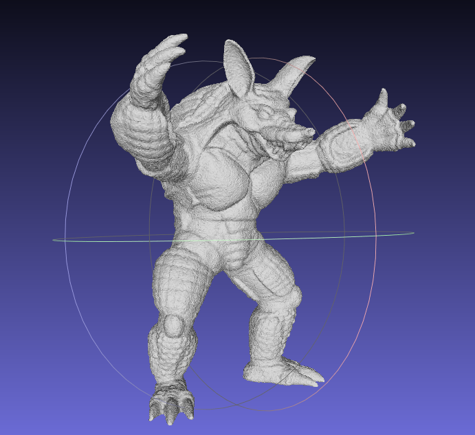
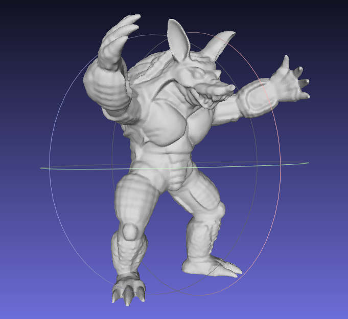

# Mamba‑Denoising

A minimal two‑stage **Mamba** pipeline for mesh denoising using **Local Surface Descriptors (LSD)**.

* Stage‑1: per‑face encoding and normal prediction.
* Stage‑2: patch‑level refinement with aggregation when a face appears in multiple patches.
* Patches are rotated to a canonical frame (center‑face normal → `(1,0,0)`), using only observable signals (no GT).

**Change sampling:** edit `globalSampling()` and `generateLocalSamplingOrder()` in `LSD.cpp`.

**Basic use:** generate `lsd.npy` & `patch_faces.npy` under `dataset/` with LSD-Gdata_mt.cpp, edit params at the top of `train_stage1.py`, run `train_stage2.py`.

This project is still in progress; a more detailed README will be posted upon completion.

## Results

  
  

Note: Left is before denoising; right is after denoising.
